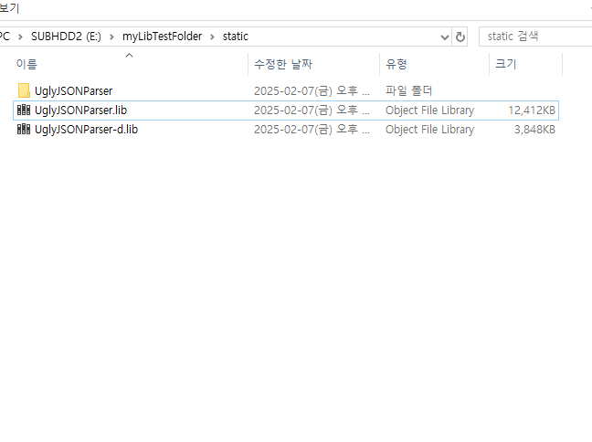
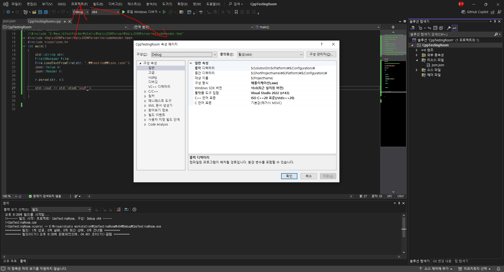
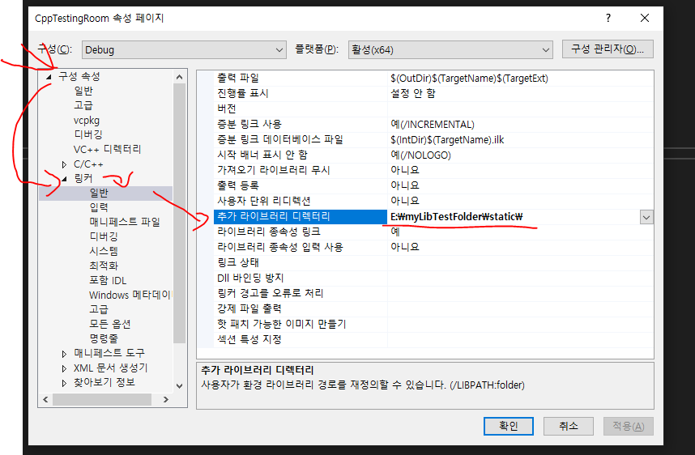
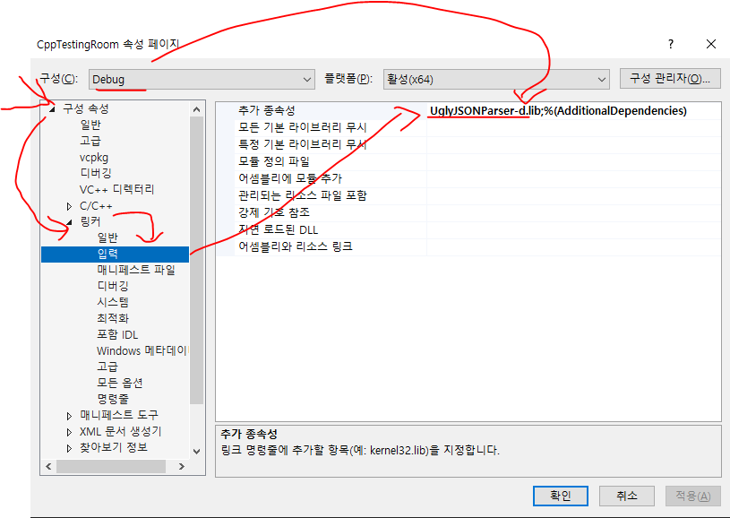
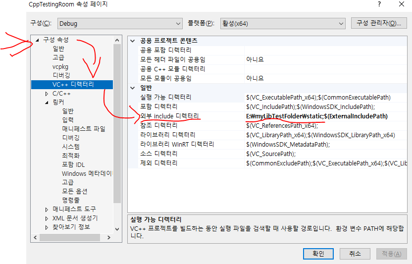

# UglyJSONParser

## 목차:

0. 라이브러리 정보
1. 개요
    + UglyJSONParser는 무엇인가요?
    + 특징
    + 한계
2. 라이브러리 설정법
    + lib과 hpp를 프로젝트에 추가하는법(windows visual studio 2022)
3. API 문서
    + 구조
    + 주요 클래스 및 함수들의 리스트와 기능들
4. 레퍼런스 문서
    + 각 클래스와 함수들 사용법
5. 예제 코드
6. 이슈 해결법
7. 기여 가이드라인(준비되지 않음)
8. 제작자
9. 최근 버전
10. 라이선스
11. 만들때 참고했던 자료들

---

# 0. 라이브러리 정보:

버전 : v1.0

요구하는 최소 c++ 버전 : c++ 20

플랫폼 도구 집합 : Visual Studio 2022 (v143)

Windows SDK 버전 : 10.0

런타임 라이브러리 : Release => MD , Debug => MDd
최소 다시 빌드 기능 : Gm- 고정

종류 : Release 구성용 => UglyJSONParser.lib , Debug 구성용 => UglyJSONParser-d.lib

스레드 안전 : 보장되지 않음.

---
# 1. 개요

## UglyJSONParser는 무엇인가요?:

### UglyJSONParser는:
1. C++용으로 개발된 무료 오픈소스 JSON파서 라이브러리 입니다.
2. 타입이 고정되어있어, 잘못된 타입으로 접근하는걸 대부분 방지해줍니다.
3. 사용이 어렵지 않습니다.
4. 비상업/상업 용도 모두 무료입니다.


## 특징:

1. 고정된 타입.
    + UglyJSONParser는 Array,Object,Null,Number(long long,double),Bool,String,Root 로 구분되며, 각 타입간의 변환이 불가합니다.(Number 내에서의 변환은 가능)
    + 이런 특징으로 인해 약간의 타입안정성을 챙겼습니다.
    + 노드를 삭제한 후 다시 생성하는 방식으로 타입을 바꿀수 있으나, **이러한 사용은 권장되지 않습니다.**
2. 사용이 어렵지 않다.
    + 복잡하게 파일을 불러오고, 그걸 저장하고, 그걸 파서에 돌리고 할 필요가 없습니다.
      
      단순히 RootNode와 읽을 파일의 주소를 파서에 입력하면, JSONTree를 RootNode에 빌드해줍니다.
    + 데이터에 접근하는것도 []로 접근하고, 접근하는 데이터 형식에 알맞은 .AsXXX() 로 접근하는게 끝입니다.
3. 내장되어있는 파일 입출력 매니저.
    + 라이브러리에 파일 입출력을 도와주는 클래스를 내장하여, 사용자가 오로지 json데이터를 다루는것에만 집중 가능하도록 도와줍니다.


## 한계:
1. 고정된 타입.
    + 고정된 타입이라는 특징은 버그를 줄여주기도 하지만, 역으로 JSON의 자유로운 문법을 이용하지 못하도록 제한하는 역할을 하기도 합니다.
2. v1.0 기준 유니코드를 지원하지 않는다.
    + 업데이트를 할 계획이 있으나, v1.0기준으로 유니코드는 정상적으로 변환이 안됩니다.
3. v1.0 기준스레드 안전을 보장하지 않는다.
4. 크로스 플랫폼의 지원이 부족하다.
    + cmake같은 도구를 지원하지 않아, 다른 플랫폼이나 컴파일러에 사용하려면, 사용자가 직접 환경에 맞게 빌드해야 됩니다.

---

# 2. 라이브러리 설정법:

## lib과 hpp를 프로젝트에 추가하는법(windows visual studio 2022)

1. UglyJSONParser의 lib파일들과 헤더 파일이 모여있는 Include폴더의 UglyJSONParser 폴더를 다운로드 하여 자신이 원하는 장소에 저장해둡니다.

    아마 Releases 탭에서 편하게 두 파일을 다운로드 받을 수 있을겁니다.
    이때, Include폴더와 lib들이 모여있는 폴더의 위치는 달라도 됩니다.

    

2. 이 라이브러리를 사용할 프로젝트를 열고, 프로젝트 속성을 엽니다.

    

3. 구성 속성 -> 링커 -> 일반탭의 추가 라이브러리 디렉터리 항목에 조금 전 lib이 있는 폴더의 위치를 복사 및 붙여넣기 합니다.

    

4. 구성 속성 -> 링커 -> 입력탭의 추가 종속성 항목에 현제 솔루션의 구성에 알맞은 lib파일의 이름을 적어줍니다.
   
   Release 구성이면 UglyJSONParser.lib을, Debug구성이면 UglyJSONParser-d.lib을 적어줍니다.

    

5. 구성 속성 -> VC++ 디렉터리의 외부 include 디렉터리에 헤더파일이 모여있는 폴더의 주소를 적어줍니다.
    
   이 항목에서 적어주는 폴더의 주소는 #include <> 의 검색 시작 주소이다.

   만약 C:\a\b에 헤더가 있고, 저 항목에 C:\a 를 적어주었다면, #include \<b\헤더_이름.hpp> 의 형태로 사용 가능하다.

    


---

# 3. API 문서:

[UglyJSONParser v1.0 API Documents](https://github.com/nuke1115/LibraryDocumentsStorage/blob/main/UglyJSONParserDocuments/API_AND_REFERENCES/v1.0/README_API_DOCUMENTS.md)


---

# 5. 예제 코드:
1. 파일에서 읽어오고 저장하기.

json.json

```json
{
    "Hello": "World!",
    "Int": 1234,
    "float": 1.234000,
    "exponent": 1000,
    "array": [ 1, 2, 3, true, false ],
    "object": { "key": "value" },
    "null": null,
    "nose": -3000
}
```

```cpp
#include <UglyJSONParser/UglyJSONParserIncludeHeader.hpp>
#include <iostream>

int main()
{
    //필요한 변수들 선언
    UglyJSONParser::JSONParser parser;
    UglyJSONParser::RootNode root;

    //json파일에서 파일을 읽어와 root노드에 JSONTree 생성
    parser.BuildJSONTreeFromFile(".\\testing\\json.json", root);

    //JSONTree에서 값을 읽어오기
    std::cout << "Hello : " << root["Hello"].AsString() << '\n';
    std::cout << "Int : " << root["Int"].AsInt() << '\n';
    std::cout << "float AsDouble : " << root["float"].AsDouble() << '\n';
    std::cout << "float AsInt : " << root["float"].AsInt() << '\n';

    std::cout << "Array 0 : " << root["array"][0].AsInt() << '\n';
    std::cout << "Array 3 : " << root["array"][3].AsBool() << '\n';
    std::cout << "Array 4 : " << root["array"][4].AsBool() << '\n';

    std::cout << "Object Key : " << root["object"]["key"].AsString() << '\n';

    std::cout << "nose : " << root["nose"].AsInt() << '\n';


    //값 수정
    std::cout << "before : Hello : " << root["Hello"].AsString() << '\n';
    root["Hello"] = "and O'men";
    std::cout << "after : Hello : " << root["Hello"].AsString() << '\n';

    //파일에 JSONTree의 값 저장
    parser.SaveJSONTreeToFile(".\\testing\\json.json", root);

    return 0;
}
```

2. string에서 읽어오기
```cpp
#include <UglyJSONParser/UglyJSONParserIncludeHeader.hpp>
#include <iostream>

int main()
{
    //필요한 변수들 선언
    UglyJSONParser::JSONParser parser;
    UglyJSONParser::RootNode root;
    std::string json = "{\"key\":\"value and this is \\\"value\\\"\",   \"arr\" : [1,1e+4,1.234]}";

    //string을 기반으로 JSONTree 생성
    parser.BuildJSONTreeFromString(json, root);


    //값 읽어오기
    std::cout << "key : " << root["key"].AsString() << '\n';
    std::cout << "arr 0 : " << root["arr"][0].AsInt() << '\n';
    std::cout << "arr 1 : " << root["arr"][1].AsInt() << '\n';
    std::cout << "arr 2 : " << root["arr"][2].AsDouble() << '\n';

    return 0;
}
```

---
# 6. 이슈 해결법

**주의** : 이 문단은 제작자가 발견하지 못한 이슈에 대한 해결법은 작성되어있지 않습니다. 만약 새로운 이슈를 발견한다면 제작자에게 연락하거나, 해당 리포지토리에 new issue를 해준다면, 가능한 한 빠른 시일 내로 업데이트 될것입니다.

### LNK 2038:
다음을 확인해보십시오:
1. 솔루션의 구성 : Debug 구성에서 Release 구성용 .lib을 사용했습니까?
2. 런타임 라이브러리가 일치합니까?

---
# 7. 기여 가이드라인:

(아직 준비되지 않았습니다.)

---

# 8. 제작자:

제작자: nuke1115

연락처:

[X(구 트위터)](https://x.com/lysrhythmgamer)

Discord : yellowsticker_ / 노란딱지#7701

[github](https://github.com/nuke1115)

---
# 9. 최근 버전:

v1.0

---
# 10. 라이선스

License : MIT License

개인용도 이용, 상업용도 이용 모두 무료입니다.

---
# 11. 만들때 참고했던 자료들:

[json 공식 문서](json.org)

[wikipedia : tree](https://en.wikipedia.org/wiki/Tree_(abstract_data_type))

[jsoncpp](https://github.com/open-source-parsers/jsoncpp?tab=readme-ov-file)